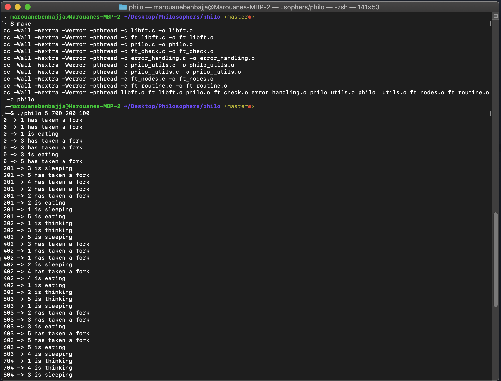

# philosophers
In this project, you will learn the basics of threading a process. You will see how to create threads and you will discover mutexes. And in the bonus part you will work with processes and semaphores.

## Overview
- the execution :
  ```bash
  <!-- Mandatory part -->
  cd philo
  <!-- Bonus part -->
  cd philo_bonus

  make

  ./philo n_philo T_to_die T_to_eat T_to_sleep max_meals_each_philosopher_must_eat

  ``````
- The program will simulate life of n_philosopher , each philosopher will take T_to_eat ms (millisecond) to eat and  T_to_sleep ms to sleep but if the one of them exceeds T_to_die ms between two meals the simulation will be end by death of this philo , else the simulation will goes.
- The last param max_meals_each_philosopher_must_eat is optional. when all philos eats max_meals_each_philosopher_must_eat time the simulation ends.
- Each philosopher is a thread.
- Each fork is a mutex.
- Every philosopher needs two forks to eat, but he has one, so he uses his friend’s fork, and here the data race occurs. So the data race problem should be resolved.
- In the bonus part each philosopher is a process and all the forks are a semaphore.

